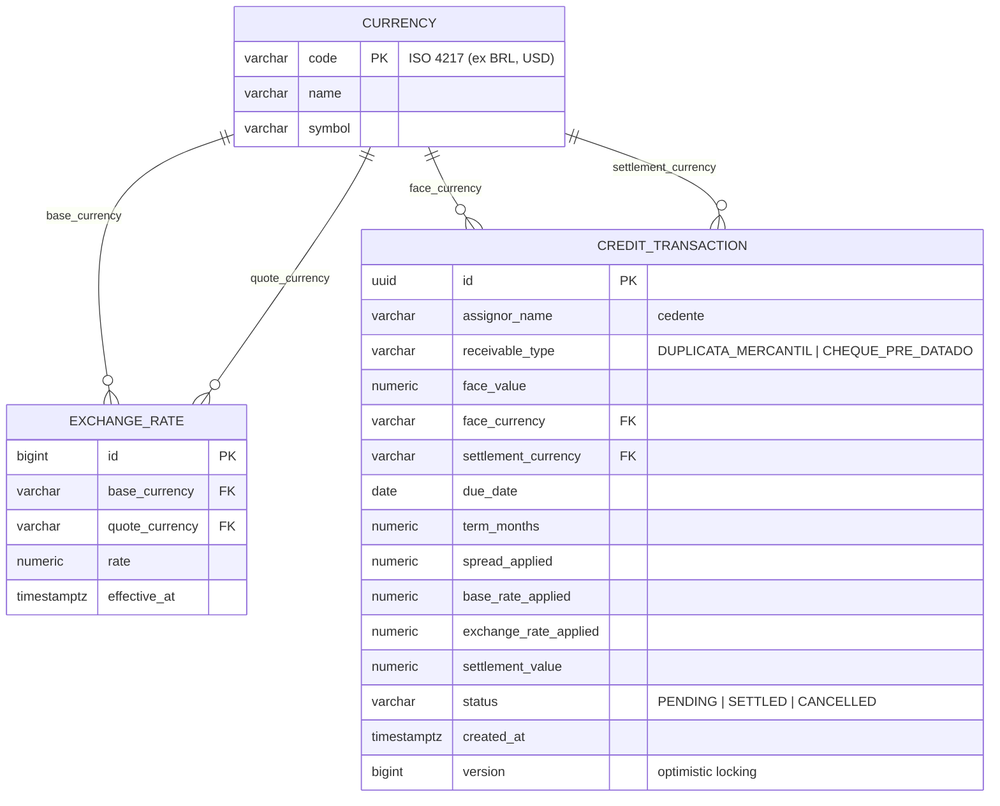

# Diagrama Entidade-Relacionamento — SRM Credit Engine

## Decisões de modelagem

- **`currency.code` como PK natural (não surrogate key)**: o conjunto de moedas é pequeno, estável e o código ISO já é um identificador único e legível por natureza — um `id` auto-incremento só adicionaria uma junção sem trazer valor.
- **`exchange_rate` é append-only (nunca UPDATE)**: cada atualização de taxa gera uma nova linha com `effective_at = now()`. Isso preserva o histórico de taxas para auditoria — uma transação liquidada há 3 meses sempre pode ser conferida com a taxa exata usada naquele momento, mesmo que a taxa atual seja outra.
- **`credit_transaction` desnormalizada de propósito**: guardamos `spread_applied`, `base_rate_applied` e `exchange_rate_applied` MESMO sabendo que eles já existem/existiram em outras tabelas. Em um motor financeiro, o registro de uma transação liquidada precisa ser imutável e autossuficiente — se a estratégia de spread mudar amanhã (ex: duplicata passa de 1.5% para 1.8%), os registros antigos não podem "mudar de valor" silenciosamente.
- **`version` (optimistic locking)**: protege contra condição de corrida em liquidações concorrentes sobre o mesmo registro, conforme requisito de item Sênior "Concorrência" — implementado aqui via `@Version` do JPA por ser de baixo custo e não exigir infraestrutura adicional.
